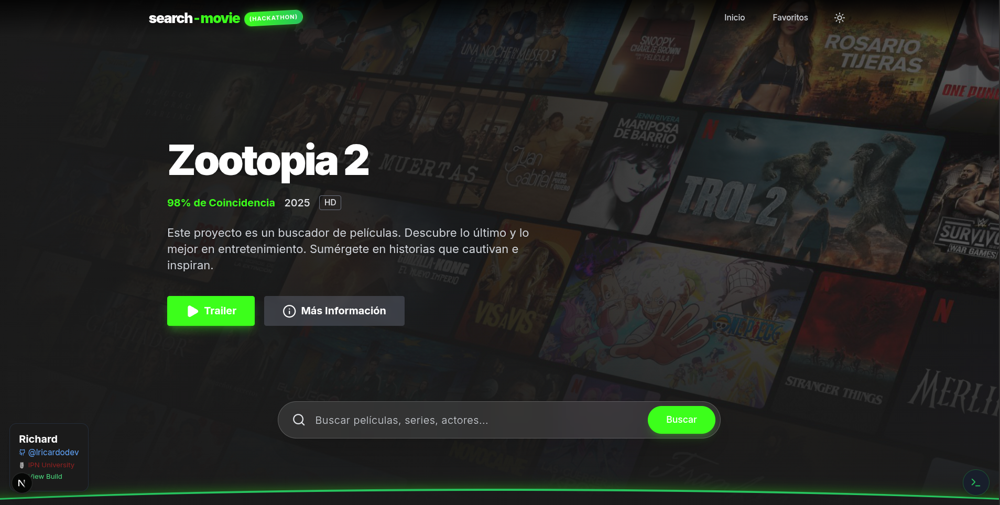

# 🎬 Media Search Engine (Hackathon Project)

Bienvenido a **Media Search Engine**, una aplicación web moderna y dinámica desarrollada para la competencia de Hackathon. Esta plataforma permite a los usuarios buscar películas y series, ver detalles completos, trailers y explorar contenido en tendencia, todo envuelto en una interfaz de usuario premium y responsiva.



## 🚀 Descripción del Proyecto

Este proyecto es un buscador de medios cinematográficos que consume la **OMDb API** para obtener información detallada de películas y series, y la **YouTube Data API** para mostrar trailers relacionados. La aplicación está construida con **Next.js 16** y **TypeScript**, enfocándose en el rendimiento, la accesibilidad y una experiencia de usuario fluida con animaciones de **GSAP**.

El objetivo es proporcionar una herramienta rápida y visualmente atractiva para los amantes del cine, con características avanzadas como modo oscuro/claro y un panel de depuración para desarrolladores y jurados.

## 🔗 Demo Desplegado

¡Prueba la aplicación en vivo aquí!

👉 **[Ver Demo en Vercel](https://media-search-engine.vercel.app/)**

## 🛠️ Tecnologías Utilizadas

El proyecto utiliza un stack tecnológico moderno y robusto:

- **Framework Principal:** [Next.js 16](https://nextjs.org/) (App Router)
- **Lenguaje:** [TypeScript](https://www.typescriptlang.org/)
- **Estilos:** [Tailwind CSS](https://tailwindcss.com/)
- **Animaciones:** [GSAP](https://gsap.com/) (@gsap/react)
- **Iconos:** [Lucide React](https://lucide.dev/)
- **APIs Externas:**
  - [OMDb API](https://www.omdbapi.com/) (Datos de películas)
  - [YouTube Data API](https://developers.google.com/youtube/v3) (Trailers)
- **Utilidades:** `clsx`, `tailwind-merge`

## ✨ Features Implementados

- **🔍 Búsqueda en Tiempo Real:** Busca películas y series por título.
- **📄 Detalles Completos:** Sinopsis, reparto, director, duración, calificaciones (IMDb, Metascore), año de lanzamiento y clasificación.
- **🎥 Trailers Integrados:** Visualización de trailers directamente en la página de detalles.
- **🔥 Tendencias y Populares:** Secciones destacadas en la página de inicio con lo más visto.
- **❤️ Favoritos:** Guarda tus películas y series favoritas (almacenamiento local).
- **🌓 Modo Oscuro/Claro:** Adaptación automática y fluida del tema.
- **📱 Diseño Responsivo:** Optimizado para móviles, tablets y escritorio.
- **🛠️ Panel de Depuración (Jury Mode):** Herramienta integrada para ver latencia de APIs y respuestas JSON en tiempo real (ideal para evaluación técnica).
- **🌐 Soporte en Español:** Interfaz completamente traducida.

## 📸 Screenshots

### Página de Inicio


### Detalles de Película


## ⚙️ Instrucciones de Instalación y Ejecución

Sigue estos pasos para levantar el proyecto en tu entorno local:

1.  **Clonar el repositorio:**

    ```bash
    git clone <url-del-repositorio>
    cd media-search-engine
    ```

2.  **Instalar dependencias:**

    ```bash
    npm install
    ```

3.  **Configurar Variables de Entorno:**

    Crea un archivo `.env.local` en la raíz del proyecto y agrega las siguientes claves. Necesitarás registrarte en los servicios correspondientes para obtenerlas:

    ```env
    # Obtén tu API Key en: https://www.omdbapi.com/apikey.aspx
    OMDB_API_KEY=tu_api_key_de_omdb

    # Obtén tu API Key en: https://console.cloud.google.com/ (YouTube Data API v3)
    YOUTUBE_API_KEY=tu_api_key_de_youtube
    ```

    > **Nota para el Jurado:** Asegúrese de que estas claves estén activas y tengan cuota disponible para probar todas las funcionalidades.

4.  **Ejecutar el servidor de desarrollo:**

    ```bash
    npm run dev
    ```

5.  **Abrir la aplicación:**

    Visita [http://localhost:3000](http://localhost:3000) en tu navegador.

---

¡Gracias por revisar mi proyecto! 🚀
